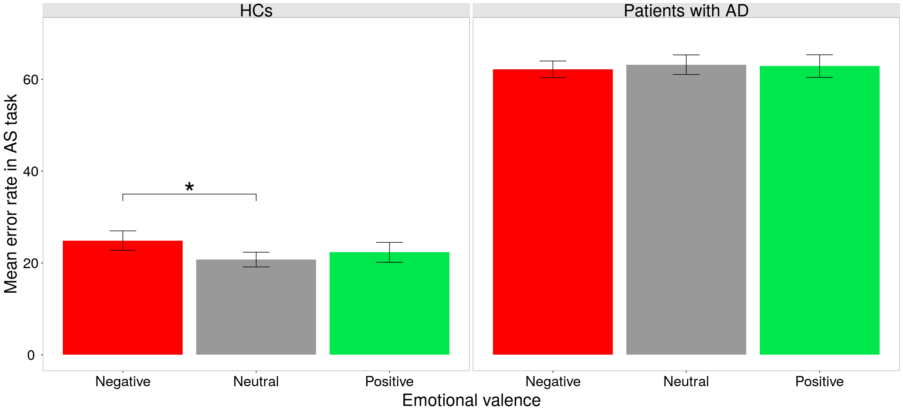
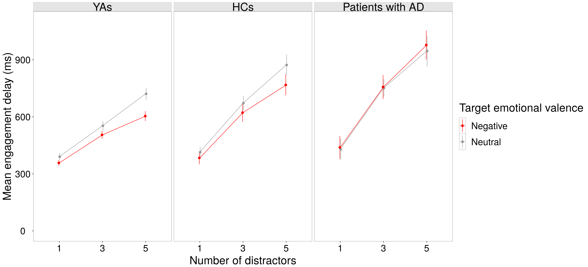

This repository provides some R functions for :
* Data shaping
* Table output (importable in LaTeX)
* Assumption checking (e.g., homogeneity, normality, residuals)
* Statistical analysis (e.g., size effect, t-test)
* Figure output

Example folder provides R files that implement some of these functions using csv files "engagement.csv" and "errors.csv" (real data collected during J. Bourgin PhD).
